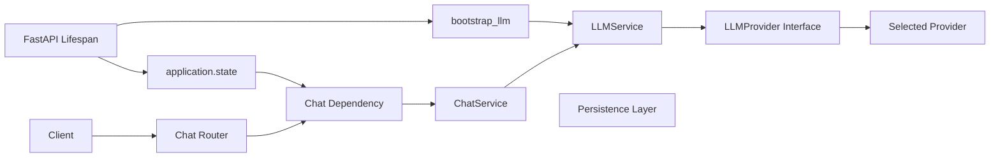

# Chat API Layer

## 状态

- 里程碑：Phase 5
- 状态：Frozen
- Freeze 日期：2026-08-27
- 公共端点：`POST /api/v1/chat/completions`
- 交互模式：非流式 JSON、SSE Streaming
- 会话状态：无状态
- Phase 5 基线 Provider：`mock`
- Phase 6 已注册 Provider：`mock`、`deepseek`、`openai`
- 供应商 SDK：无；真实 Provider 的网络只存在于下层 Adapter

Chat API Layer 是 HTTP 客户端访问冻结 LLM Provider Layer 的稳定适配边界。它负责
校验公共输入、协调一次生成调用、输出独立 HTTP/SSE DTO，并把统一 LLM 错误转换为
安全的传输层错误。它不承担聊天历史、用户身份、持久化、缓存或供应商选择。

Phase 6 后续在冻结 LLM 契约下新增了 DeepSeek/OpenAI Adapter，没有修改本文定义的
Chat Request、Response、SSE、错误映射、Service 或路由语义。

## Phase 5 完成范围

Phase 5 已完成：

- 严格、供应商无关的 Chat HTTP Request、Response、Usage 和 Stream Event Schema；
- 无状态 `ChatService`，负责 Chat DTO 与冻结 LLM DTO 之间的转换；
- FastAPI Lifespan 中 LLMService 的创建、`application.state` 注入和关闭；
- Router 专用 `ChatService` Dependency；
- `POST /api/v1/chat/completions` 非流式 JSON；
- 同一路径的 `stream=true` SSE Streaming；
- `chunk`、`done`、`error` 三类 SSE Event；
- LLMException 到 `ApplicationError`/安全 SSE Event 的集中映射；
- 完全离线的 Schema、Service、生命周期、API、SSE 和错误 Contract Tests；
- AST/导入扫描形式的架构边界测试。

## Phase 5 明确未完成范围

以下能力不属于 Phase 5：

- 用户登录、JWT、认证或权限系统；
- 聊天历史、Conversation、Message、User ORM 模型或数据库存储；
- Redis 缓存、限流或会话逻辑；
- RAG、Embeddings、向量数据库和文件上传；
- WebSocket、Vue 前端或其他 UI；
- Home Assistant、Agent、MCP、Tool Calling 或 Function Calling；
- 真实 DeepSeek/OpenAI 或其他供应商 Adapter、SDK 和网络请求；
- 视觉、音频或其他多模态能力。

## 组件职责

| 路径 | 职责 | 明确不负责 |
| --- | --- | --- |
| `app/schemas/chat.py` | 定义严格、不可变的公开 HTTP/SSE DTO | LLM SDK 类型、持久化模型、供应商选项 |
| `app/services/chat.py` | 映射 DTO 并调用注入的 `LLMService` | HTTP、Provider 选择、历史、缓存、数据库 |
| `app/api/dependencies/chat.py` | 从 `application.state` 获取 LLMService 并构建 ChatService | Bootstrap、环境变量、全局单例 |
| `app/api/v1/routes/chat.py` | 接收 HTTP 输入，选择 JSON/SSE 输出并管理流边界 | 业务组装、Provider、Repository |
| `app/api/error_mapping/llm.py` | 把 LLMException 映射为固定、安全的 HTTP 错误 | 返回原始异常、供应商诊断或敏感数据 |
| `app/main.py` | 在应用 Lifespan 中创建、保存并关闭 LLMService | 改变 `/ready` 的数据库语义 |

## 依赖边界

Router 只知道 `ChatService`，ChatService 只接收已构建的 `LLMService`。Registry、
Factory、Bootstrap 和具体 Provider 只存在于组合路径，不可成为 Router 或
ChatService 的 Service Locator。Chat 运行路径与 Persistence Layer 没有依赖边。

## 公共 HTTP 契约

### Request

`ChatRequest` 表示一次无状态生成：

- `messages`：至少一条；至少包含一条 `user`；最后一条必须为 `user`；
- `messages[].role`：只允许 `user`、`assistant`，不要求严格交替；
- `messages[].content`：非空且不能全为空白；
- `model_name`：可选的模型名；
- `temperature`：可选，范围 `0..2`；
- `max_tokens`：可选正整数；
- `stream`：严格布尔值，默认 `false`；
- `request_id`：可选的单次请求关联 ID，缺失时由 ChatService 生成。

所有未知字段均被拒绝。当前契约没有 `conversation_id`、`user_id`、`session_id`、
`system_prompt`、tools、functions、metadata、`extra_kwargs` 或任何供应商选项。

`messages` 可承载客户端临时提供的多轮上下文，但服务端不读取、保存或补建历史。
不开放客户端 `system` role，是为了给未来服务端策略与安全编排保留可信边界；这不表示
当前系统已经实现系统提示词。

### Response

非流式 `ChatResponse` 包含：

- `answer`、`provider_name`、`model_name`、`finish_reason`；
- 可选标准化 `usage`；
- `request_id`；
- 服务端生成并规范化为 UTC 的 `created_at`。

公开响应不会直接复用 `LLMResponse`，也不包含 `provider_request_id`、SDK response、
SDK usage、供应商原始错误或内部异常。

## 生命周期与依赖注入

FastAPI Lifespan 在数据库生命周期建立后调用冻结的 `bootstrap_llm()`，将返回的
`LLMService` 存入当前应用实例的 state。关闭阶段调用 `LLMService.aclose()`；即使 LLM
创建或关闭失败，已创建的数据库资源仍按既有路径释放。

Dependency 只从 state 取得 Service 并构建无状态 `ChatService`，不读取 Settings、
不执行 Bootstrap，也不持有全局状态。`LLM_PROVIDER=mock` 可离线启动；Phase 6 注册的
DeepSeek/OpenAI 由同一组合根创建，配置缺失或任何未注册 Provider 都会 fail fast，
不会自动回退。

LLM 生命周期集成没有改变系统端点：`/health` 仍是进程存活检查，`/ready` 仍只验证
既有应用和 PostgreSQL，`/version` 仍返回应用版本。LLM 不执行远程 readiness 探活。

## 非流式调用

当 `stream` 缺失或为 `false` 时，Router 调用 `ChatService.complete()`。Service 生成或
沿用 `request_id`，映射为 `LLMRequest.correlation_id`，通过 `LLMService.generate()`
完成调用，再复制标准字段到独立 `ChatResponse`。请求消息和响应不会存入 Service。

## SSE Streaming

当 `stream=true` 时，Router 返回 `text/event-stream`：

- `chunk`：包含 `sequence`、`delta`、`request_id`、Provider、模型和 UTC 时间；
- `done`：包含最终 sequence、finish reason、可选 usage、request ID、Provider、模型和
  UTC 时间；空文本响应也必须产生该事件；
- `error`：只用于响应已经开始后的安全错误，包含固定 code/message、request ID、UTC
  时间和可选的 `retry_after_seconds`。

Router 在发送响应头前预取第一个事件。预取期间失败仍可返回统一 HTTP 状态；响应开始
后失败不能修改状态码，只能发送一个安全 `error` Event 并结束流。整个流的
`request_id` 必须一致。

客户端断开或取消会向上传播，`asyncio.CancelledError` 不被捕获为普通错误。
ChatService 和 Router 在退出路径分别关闭其持有的上游迭代器。实现按 Chunk 转发，
不缓存完整 Prompt、完整生成结果或完整 Chunk 序列，也不记录 Chunk 正文。

本阶段使用 SSE 而不是 WebSocket，因为生成过程是一次 HTTP 请求对应单向服务器事件流；
SSE 已满足事件顺序、断开取消和代理友好需求，无需提前引入双向连接及其状态管理。

## 统一错误映射

响应开始前，预期 LLM 失败映射如下：

| LLM 异常 | HTTP | 公共错误码 |
| --- | ---: | --- |
| `ProviderConfigurationError` | 500 | `llm_configuration_error` |
| `ProviderNotRegistered` | 500 | `llm_provider_not_registered` |
| `ProviderAuthenticationError` | 502 | `llm_provider_authentication_failed` |
| `ProviderRateLimitError` | 429 | `llm_rate_limited` |
| `ProviderTimeout` | 504 | `llm_provider_timeout` |
| `ProviderUnavailable` | 503 | `llm_provider_unavailable` |
| `ProviderInvalidResponse` | 502 | `llm_invalid_response` |
| 其他 `LLMException` | 502 | `llm_provider_error` |

错误映射返回固定安全文案，不返回 `str(exception)`、异常 cause、供应商 HTTP 错误或
SDK Exception。details 只可能包含客户端提供的 `request_id` 和经过有限值校验的
`retry_after_seconds`。请求校验继续使用既有 422 结构；未知异常继续交给既有安全 500
Handler。响应开始后的同类错误使用相同 code/message 构建 SSE `error` Event。

## 安全与隐私

API Key、Authorization Header、完整 Prompt、消息正文、完整生成结果、Chunk 正文、
SDK Request/Response/Event、供应商异常及 `provider_request_id` 不得进入日志、错误响应、
trace attribute 或测试快照。当前只允许记录经过评审的最小元数据，例如 request ID、
Provider、模型、耗时、token 数和公共错误码。

## 测试与质量门禁

默认 `python -m pytest` 完全离线，Phase 5 覆盖：

- Chat Schema 的角色、上下文、范围、未知字段和独立 Response/Event 契约；
- ChatService 的 DTO 映射、无状态性、异常/取消传播和迭代器关闭；
- LLM 生命周期、应用实例隔离、Dependency 与启动失败清理；
- 非流式 JSON、SSE chunk/done/error、首事件预取和取消释放；
- 所有 LLMException 的安全 HTTP 映射和敏感信息不泄露；
- Chat、LLM、Persistence、Router 的 AST/导入依赖边界；
- Chat 层不导入 Provider、供应商 SDK、HTTP Client，也不读取 API Key；
- `/health`、`/ready`、`/version` 路径和语义无回归。

PostgreSQL 连接、Alembic 和 Repository 集成测试继续使用显式
`python -m pytest --run-integration`，不属于默认离线 Chat 测试前置条件。

## 未来扩展

- 有状态聊天必须新增 Conversation Service，并通过 Repository Protocol 引入历史；
- Conversation/Message 模型需要独立阶段、迁移和持久化评审；
- 新能力应使用新增接口或上层模块，不得改变当前无状态 completions 语义；
- 后续 Claude/Gemini/Qwen/Kimi 等 Adapter 只能扩展 Provider Layer，不应修改 Chat
  Router、ChatService 或公共 Chat DTO；
- Web、Vue、语音终端和 Home Assistant 应调用当前稳定 API，而不是具体 Provider；
- 认证、限流、观测、内容安全和成本跟踪必须作为独立横切边界设计。

## Architecture Constraints

Freeze 后必须遵守：

1. `POST /api/v1/chat/completions` 保持无状态，不得保存消息或生成会话状态。
2. `request_id` 只表示一次调用，不得转用为 conversation、user 或 session 标识。
3. Chat Router 只能通过 Dependency 获取并调用 `ChatService`。
4. Router 不得导入或调用 `LLMService`、具体 Provider、Registry、Factory 或 Bootstrap。
5. `ChatService` 只能依赖注入的 `LLMService` 和稳定 DTO，不得依赖 FastAPI。
6. `ChatService` 不得依赖数据库、Repository、SQLAlchemy、Redis 或环境变量。
7. Chat API 不得直接或间接增加数据库 Dependency，不得读写 Persistence Layer。
8. Chat HTTP/SSE Schema 必须独立于 LLM Schema 和任何 SDK 类型。
9. 不得暴露 `provider_request_id`、SDK 对象、供应商异常或 vendor-specific 字段。
10. 公共 Request 必须继续拒绝未知字段、`system` role 和契约逃生口。
11. SSE 只使用 `chunk`、`done`、`error` 契约；不以 WebSocket 替换现有语义。
12. 流取消必须传播，所有上游异步迭代器必须在退出路径释放。
13. 不得缓存或记录完整 Prompt、完整响应或完整 Chunk 内容。
14. LLMException 必须集中映射为固定、安全的 HTTP/SSE 错误。
15. 不得把异常字符串、cause、API Key 或供应商诊断返回客户端。
16. LLM 生命周期只能由应用 Lifespan 组装；不得使用全局可变 Service 单例。
17. 未注册 Provider 必须 fail fast，不得静默回退、降级或自动切换。
18. `/health`、`/ready`、`/version` 路径和既有语义不得改变；LLM 不加入 readiness。
19. 真实 Provider 接入不得要求修改 Chat API、ChatService 或 Persistence Layer。
20. 改变 Chat Request/Response、SSE Event、错误码或端点语义必须独立架构评审并考虑
    版本化兼容。
21. 有状态聊天只能通过新增 Conversation Service、Repository Protocol 和新增接口扩展。
22. Phase 5 扩展不得破坏 Phase 3 Persistence 或 Phase 4 LLM Provider Freeze 边界。

## Freeze 基线

Phase 5 Freeze 基线由以下内容组成：

- `backend/app/schemas/chat.py` 的公开 HTTP/SSE 契约；
- `backend/app/services/chat.py` 的无状态 Application Service；
- `backend/app/api/dependencies/chat.py`、`app/main.py` 的应用生命周期与依赖注入；
- `backend/app/api/v1/` 的版本化 Chat Router；
- `backend/app/api/error_mapping/` 的安全 LLM HTTP 映射；
- `backend/tests/chat/` 的离线 Contract Tests 和架构扫描；
- 根 README、本文、Chat API 使用说明、架构总览和开发规范；
- Freeze 验收时默认套件 `201 passed, 4 skipped`，无测试失败。

`4 skipped` 是默认关闭的 Phase 3 PostgreSQL 集成测试，不是 Chat 测试跳过。Freeze
工作台使用 Python 3.12.13 对同一依赖集进行离线复验；项目正式运行基线仍为 Python
3.13，并应由 Docker/CI 持续验证。

**Chat API Layer 已冻结（Freeze），后续阶段不得破坏无状态 Chat Completions 公共
契约，只允许通过新增上层模块或新增接口进行扩展。**
