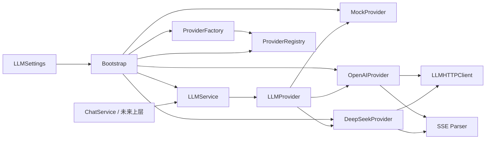

# LLM Provider Layer

## 状态

- Phase 4 公共 Provider 契约：Frozen；
- Phase 5 Chat API 对该契约的使用：Frozen；
- Phase 6 DeepSeek/OpenAI Adapter 实现：代码与静态门禁完成；
- Phase 6 Freeze：**Pending / 待正式 pytest 验证**；
- 已注册 Provider：`mock`、`deepseek`、`openai`；
- 供应商 SDK：无，真实调用使用内部 `httpx` 边界。

Phase 6 尚未在当前机器的项目 Python 3.13 环境成功执行正式全量
`python -m pytest`，真实 Provider Integration Tests 也尚未在显式授权和成本确认后
实际运行。因此本文不得声明 Phase 6 已正式 Frozen。

LLM Provider Layer 是 Chat API 以及未来知识库、Agent、Home Assistant 和语音模块访问
模型的唯一基础设施入口。它隔离供应商 HTTP/SSE 协议、认证、响应格式和错误，上层只
依赖冻结的请求、响应、流式、异常和 Service 契约。

## Phase 6 完成范围

Phase 6 已实现：

- DeepSeek Provider Adapter；
- OpenAI Provider Adapter；
- 非流式 `generate()`；
- 流式 `stream_generate()`；
- 内部、供应商无关的 HTTP Client；
- 增量、协议级 SSE Parser；
- Provider 配置增强与 timeout 继承；
- Bootstrap 显式注册 `mock`、`deepseek`、`openai`；
- Factory 通过 Registry 创建选中的 Provider；
- 默认离线 Contract Tests；
- 显式、成本感知的真实 LLM Integration Tests；
- 默认 DNS/Socket 网络阻断门禁；
- 供应商 SDK 禁入门禁；
- DTO、架构依赖和敏感信息泄漏门禁。

“已实现 Integration Tests”表示测试代码和显式门禁已经建立，不表示真实测试已经执行
通过。实际运行状态见 [LLM Integration 测试指南](../testing/llm-integration.md)。

## Phase 6 明确未完成范围

Phase 6 没有实现或改变：

- Chat API 公共契约；
- ChatService 公共契约；
- LLMService 公共契约；
- Provider Interface 公共契约；
- 数据库存储或聊天历史；
- Conversation、Message、User ORM 模型；
- 用户认证、JWT 或权限系统；
- Redis 逻辑；
- RAG、Embeddings 或向量数据库；
- 文件上传或多模态；
- WebSocket 或 Vue 前端；
- Home Assistant；
- Agent、Tool Calling、Function Calling 或 MCP；
- 自动 Provider fallback、routing 或 retry；
- 成本统计、预算治理或按用户计费；
- 内容安全策略。

## 组件职责

| 路径 | 职责 | 明确边界 |
| --- | --- | --- |
| `app/llm/interfaces/provider.py` | 冻结的 `LLMProvider` Protocol | 不依赖 HTTP、供应商、FastAPI 或数据库 |
| `app/llm/schemas/` | 冻结的 LLM Request/Response/Chunk DTO | 不包含 HTTP/SDK 对象或供应商参数 |
| `app/llm/exceptions.py` | 稳定、可捕获的统一异常 | 不向上传播供应商或 httpx 异常 |
| `app/llm/config.py` | 读取、校验和保护 LLM 配置 | 不创建 Provider，不执行网络请求 |
| `app/llm/http/client.py` | 创建和关闭内部 Async HTTP Client | 不解释供应商 JSON，不依赖上层模块 |
| `app/llm/http/sse.py` | 增量解析 SSE frame 和 `[DONE]` | 不知道供应商 Chunk 或 LLM DTO |
| `app/llm/providers/mock.py` | 确定性、零网络 Provider | 无密钥、无外部资源 |
| `app/llm/providers/deepseek.py` | DeepSeek HTTP/SSE 与冻结 DTO 互转 | 供应商语义仅存在于本 Adapter |
| `app/llm/providers/openai.py` | OpenAI HTTP/SSE 与冻结 DTO 互转 | 供应商语义仅存在于本 Adapter |
| `app/llm/registry.py` | 保存、校验并冻结显式注册 | 实例级状态，不是 Service Locator |
| `app/llm/factory.py` | 通过 Registry 创建选中 Provider | 无供应商条件分支，不读取环境变量 |
| `app/llm/bootstrap.py` | 组合 Settings、Registry、Factory、Provider、Service | 唯一知道具体 Provider 的组合根 |
| `app/llm/service.py` | 上层唯一 LLM 调用入口 | 只依赖 Provider Interface 和冻结 DTO |

## 依赖与调用流程



Factory 不导入具体 Provider，Bootstrap 使用构造器/`partial` 显式注册并冻结 Registry。
Adapter 不依赖 FastAPI、ChatService、LLMService、数据库、Repository、SQLAlchemy 或
Redis。HTTP/SSE 组件不反向依赖 Provider。

## 冻结公共契约

### Provider Interface

每个 Provider 必须提供：

- `provider_name`：稳定、规范化的注册名称；
- `default_model`：请求没有覆盖时的模型；
- `generate(request)`：返回标准 `LLMResponse`；
- `stream_generate(request)`：返回 `LLMStreamChunk` 异步迭代器；
- `aclose()`：幂等释放 Provider 所有资源。

### Request

`LLMRequest` 只表示一次文本生成输入，包含消息、可选模型、temperature、max tokens 和
correlation ID。它不表示聊天历史，也不包含 Tool/Function Calling、Embeddings、
Vision、Audio、供应商 options 或 `extra_kwargs`。

### Response 与 Streaming

`LLMResponse` 和 `LLMStreamChunk` 只暴露规范化文本、Provider、实际模型、finish reason、
token usage 和内部 Provider request ID。原始 `httpx.Request/Response`、供应商 JSON、
SSE frame 和异常不得越过 Adapter。

流式 sequence 必须连续，usage 和 finish reason 只出现在 final chunk。取消必须传播；
Provider、HTTP response 和 SSE iterator 必须在完成、异常或取消路径关闭。

## Provider 选择

```text
LLM_PROVIDER=mock      -> MockProvider
LLM_PROVIDER=deepseek  -> DeepSeekProvider
LLM_PROVIDER=openai    -> OpenAIProvider
```

Registry 是名称是否已注册的最终权威。Settings 负责格式和选中 Provider 的必需配置，
Factory 只查 Registry，Bootstrap 负责显式注册。任何失败都明确抛出统一异常，不静默
回退到 Mock，也不自动切换或降级。

## 配置说明

`LLMSettings` 使用 Pydantic Settings 从环境变量和本地 `.env` 读取配置，模板为根目录
`.env.example`。

### 通用配置

| 环境变量 | 要求 | 说明 |
| --- | --- | --- |
| `LLM_PROVIDER` | 必需 | `mock`、`deepseek`、`openai`；规范化为小写 |
| `LLM_DEFAULT_MODEL` | 必需 | 保留既有供应商无关默认模型语义 |
| `LLM_TIMEOUT_SECONDS` | 正数 | connect/read/stream 的继承基线 |
| `LLM_CONNECT_TIMEOUT_SECONDS` | 可选正数 | 建连时间上限；空时继承基线 |
| `LLM_READ_TIMEOUT_SECONDS` | 可选正数 | 非流式读取上限；空时继承基线 |
| `LLM_STREAM_TIMEOUT_SECONDS` | 可选正数 | 相邻流事件空闲上限；不是总流时长 |
| `LLM_DEFAULT_TEMPERATURE` | `0..2` | 默认生成温度 |
| `LLM_DEFAULT_MAX_TOKENS` | 正整数 | 默认生成 token 上限 |

### DeepSeek

选择 `deepseek` 时必须提供 `DEEPSEEK_API_KEY`、`DEEPSEEK_BASE_URL` 和
`DEEPSEEK_DEFAULT_MODEL`。

### OpenAI

选择 `openai` 时必须提供 `OPENAI_API_KEY`、`OPENAI_BASE_URL` 和
`OPENAI_DEFAULT_MODEL`。

选择 `mock` 时不需要任何真实 Provider 密钥，非选中 Provider 配置可以为空。Base URL
必须由环境提供、使用 HTTPS，且不得包含 userinfo、query 或 fragment。尾部斜杠由
Settings 规范化。

API Key 使用 `SecretStr`，但不得写入代码、文档值、日志、异常或命令历史。配置错误
fail fast，不会自动使用 Mock。

## DeepSeek Adapter

DeepSeek Adapter：

- 把冻结 LLM messages/model/temperature/max tokens 映射到 Chat Completions 请求；
- 非流式解析文本、model、finish reason、usage 和 request ID；
- 流式使用公共 SSE Parser 增量解析并输出标准 Chunk；
- 检测 Tool/Function Call、身份漂移、缺少 `[DONE]`、无效 usage 和非法 shape；
- 把认证、限流、超时、不可用和无效响应转换为统一异常；
- 不保留完整生成结果，不吞掉 `CancelledError`。

## OpenAI Adapter

OpenAI Adapter 与 DeepSeek 使用相同公共接口，但供应商映射独立：

- 使用受控 Chat Completions 字段；
- 将公共 max tokens 映射为 Adapter 支持的请求字段；
- 固定单候选且不要求供应商存储响应；
- 独立解析 OpenAI 非流式和流式 JSON；
- 把 HTTP/SSE/供应商错误转换为相同统一异常层级；
- 不共享或假设 DeepSeek 的 JSON 实现。

真实 Provider 使用内部 `httpx.AsyncClient`，不安装 OpenAI 或 DeepSeek SDK。

## HTTP Client 与 SSE Parser

内部 HTTP Client：

- 由调用方显式创建，不存在模块导入时 Client 或全局单例；
- 支持注入 `httpx.MockTransport`；
- 使用 connect/read/stream timeout；
- 固定 `trust_env=False`，不继承系统代理；
- Header 使用 redaction-aware 容器，禁止记录 Authorization；
- `aclose()` 幂等。

SSE Parser：

- 支持分块输入、多行 `data:`、空行边界、comment/keep-alive 和 `[DONE]`；
- 只缓存当前未完成 frame，不缓存完整流；
- 不解析 JSON，不知道 DeepSeek/OpenAI Chunk shape；
- 协议错误使用内部安全异常并由 Adapter 映射；
- 不吞掉取消，退出时关闭上游 iterator。

## 统一异常与安全

| 异常 | 含义 |
| --- | --- |
| `ProviderConfigurationError` | 配置或供应商拒绝的请求参数 |
| `ProviderAuthenticationError` | 凭据被拒绝 |
| `ProviderRateLimitError` | 供应商限流，可包含安全 retry-after |
| `ProviderTimeout` | connect/read/stream 超时 |
| `ProviderUnavailable` | 网络或供应商暂时不可用 |
| `ProviderInvalidResponse` | 响应不符合冻结契约 |
| `ProviderNotRegistered` | 配置名称未在 Registry 注册 |

统一异常不得携带原始 httpx/供应商对象作为公开属性或 cause。API Key、Authorization
Header、完整 Prompt、完整模型响应、完整 Chunk 和供应商原始错误不得进入日志、异常、
Chat DTO、trace attribute 或测试输出。

## 测试体系

### 默认离线测试

```bash
cd backend
python -m pytest
```

默认套件通过 MockProvider、独立 MockTransport、公共 Contract Tests、Provider 专用映射
测试、网络阻断、SDK 禁入、DTO 和架构扫描覆盖 Phase 3–6，不需要真实密钥或账号。

### PostgreSQL integration

```bash
cd backend
python -m pytest --run-integration
```

该开关只启用 Phase 3 数据库测试，不启用真实 LLM。

### 真实 LLM integration

```bash
cd backend
LLM_INTEGRATION_ACKNOWLEDGE_COST=true python -m pytest --run-llm-integration
```

只有带 `llm_integration` marker 的测试可运行；缺少 CLI 开关、成本确认、目标 API Key、
Base URL 或模型时会安全 skip。真实测试只执行每个 Provider 的最小 generate/stream 调用，
不测试付费错误场景。详细 PowerShell 命令和门禁见
[LLM Integration 测试指南](../testing/llm-integration.md)。

## 新 Provider 扩展规则

新增 Claude、Gemini、Qwen、Kimi 或其他 Provider 时：

1. 新增独立 Adapter，实现冻结 Interface；
2. 复用内部 HTTP/SSE 边界，供应商 JSON 只在 Adapter 内解释；
3. 把所有错误转换为统一异常，不暴露原始对象；
4. 通过 LLMSettings 接收配置，不直接读取环境；
5. 在 Bootstrap 显式注册，不修改 Factory 供应商分支；
6. 加入同一公共 Contract Tests 和独立供应商 MockTransport 测试；
7. 真实 Integration Tests 必须显式 opt-in、成本确认并隔离；
8. 不修改 Chat API、LLMService、Provider Interface 或 Persistence Layer。

当前架构门禁禁止供应商 SDK。若未来确需 SDK，必须先进行独立架构、安全、依赖和 DTO
泄漏评审，不能直接把 SDK 加入 Adapter 或公共依赖。

## Phase 6 Architecture Constraints

1. Phase 4 公共 Provider/Request/Response/Chunk/Exception/Service 契约不得修改。
2. 业务模块只能调用 LLMService，不得直接调用具体 Provider、Registry 或 Factory。
3. Provider 不得依赖 FastAPI、Chat、数据库、Repository、SQLAlchemy 或 Redis。
4. HTTP/SSE 内部模块不得依赖具体 Provider 或上层模块。
5. 供应商 JSON、HTTP 对象和异常不得越过 Adapter。
6. Bootstrap 是具体 Provider 的唯一组合根，Factory 不得增加供应商条件分支。
7. Registry 必须实例级、显式注册并在组合后冻结。
8. 不得实现静默 fallback、自动 routing、自动 retry 或自动降级。
9. API Key、Authorization Header、完整 Prompt/Response/Chunk 不得记录或返回。
10. Base URL、模型和密钥只能来自 Settings/环境，不得写死。
11. HTTP Client 必须 `trust_env=False`，资源关闭必须幂等。
12. 流式取消必须传播，所有上游 iterator/response/client 必须释放。
13. MockProvider 必须保持零网络、确定性、无密钥和默认 CI 可用。
14. 默认 pytest 必须阻断真实网络且不需要真实配置。
15. 真实 LLM 测试必须使用独立 marker、CLI 开关和成本确认。
16. `/health`、`/ready`、`/version` 语义不得改变，LLM 不进入 readiness。
17. Phase 3 Persistence、Alembic、Docker 启动链和 Phase 5 Chat API 不得受影响。
18. 任何公共契约、SDK、代理、重试、fallback 或路由变更必须独立架构评审。

## Phase 6 Freeze 准备基线

Freeze 准备基线包含：

- `backend/app/llm/config.py`；
- `backend/app/llm/http/`；
- `backend/app/llm/providers/deepseek.py` 与 `openai.py`；
- `backend/app/llm/bootstrap.py` 的显式注册；
- `backend/tests/llm/` 默认离线测试；
- `backend/tests/integration/llm/` 显式真实测试；
- `backend/tests/conftest.py` 网络与成本门禁；
- `.env.example`、README 和 Phase 6 文档。

当前已完成代码审查、语法检查、架构/SDK/敏感信息静态扫描，但正式 pytest 被环境阻塞。

### Freeze 状态

项目已在 Python 3.13 环境安装 `.[test]` 并完成默认全量 pytest，Phase 3/4/5/6 默认回归
已经记录。因此：**Phase 6 — Real LLM Provider Adapters 已冻结（Freeze）。**

真实 DeepSeek/OpenAI Integration 仍为 `Not Run`，费用为 `0`；这不得被描述为真实 Provider
线上验证通过，也不改变已验证的默认离线 Freeze 基线。
