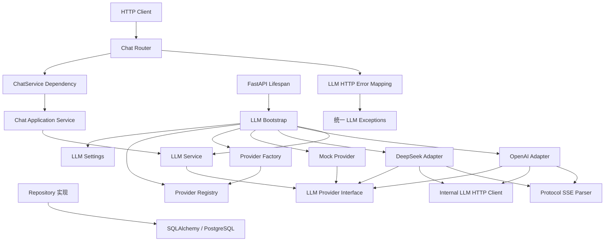
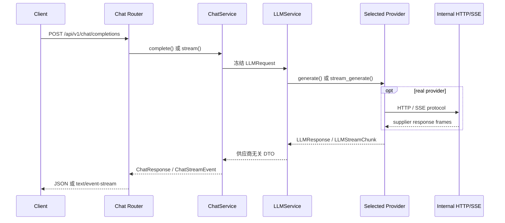

# 架构总览

## 当前基线

Home AI Hub 已形成四层后端基线：

1. Phase 3 Persistence Layer：PostgreSQL 17、Async SQLAlchemy、Alembic、Repository
   基础层和数据库 readiness，已冻结；
2. Phase 4 LLM Provider Layer：供应商无关契约、Registry、Factory、Bootstrap、Mock、
   LLMService 和统一异常，公共契约已冻结；
3. Phase 5 Chat API Layer：无状态 HTTP Schema、ChatService、JSON/SSE、安全错误映射和
   生命周期注入，已冻结；
4. Phase 6 Real Provider Adapters：内部 HTTP/SSE 基础设施、DeepSeek/OpenAI Adapter、
   显式注册、离线 Contract Tests 和 opt-in Integration Tests，代码与静态门禁完成。

当前环境尚未在项目 Python 3.13 中成功执行正式全量 `python -m pytest`，真实 Provider
Integration Tests 也尚未实际运行。因此 Phase 6 状态是 **Freeze Pending / 待正式
pytest 验证**，不是正式 Frozen。

Redis 目前只随 Docker Compose 启动，不参与应用逻辑。聊天历史、用户系统、RAG、Agent、
Home Assistant 和前端仍不在当前范围。

## 依赖方向



依赖始终从 HTTP Adapter、Application Service、组合根和具体 Provider 指向冻结抽象。
Chat Router 不知道 Provider、Registry、Factory、Bootstrap 或数据库；ChatService 只
依赖注入的 LLMService。Provider Layer 与 Persistence Layer 没有依赖边。

## Provider 组合

Bootstrap 是唯一同时知道 Settings、Registry、Factory 和具体 Provider 的组合根：

```text
LLM_PROVIDER=mock      -> MockProvider
LLM_PROVIDER=deepseek  -> DeepSeekProvider
LLM_PROVIDER=openai    -> OpenAIProvider
```

Registry 显式注册三个构造器并在组合后冻结。Factory 只通过 Registry 查找，不包含随
供应商增长的 `if/elif/else`。配置缺失、Provider 未注册或构造失败都会 fail fast，
不会自动回退、路由、重试或降级。

FastAPI Lifespan 创建一次 LLMService，保存到当前 application state，并在关闭时调用
`aclose()`。不存在全局 Provider、LLMService 或 ChatService 单例。

## 请求路径



真实 Adapter 只在其内部解释供应商 JSON，并把 HTTP、协议和供应商错误转换为统一
LLMException。`httpx.Request/Response`、Authorization Header、原始 JSON 和供应商异常
不会越过 Provider 边界。Chat DTO 不暴露内部 `provider_request_id`。

## Readiness 与网络

- `/health` 仍只表示进程存活；
- `/ready` 仍只检查应用和 PostgreSQL；
- `/version` 仍返回应用版本；
- Bootstrap 和 readiness 不发起远程 LLM 探活；
- 默认 Provider 为 `mock`，无需密钥和网络；
- 真实 Provider 的可用性通过受控调用和显式 Integration Tests 验证。

默认 pytest 使用 DNS/Socket 门禁。只有 PostgreSQL `--run-integration` 或同时满足 marker、
`--run-llm-integration` 与成本确认的真实 LLM 测试可以访问对应外部资源，两种开关互不
授权。

## 稳定边界

### Phase 3 Persistence Layer — Frozen

- `backend/app/db/`、`app/models/`、`app/repositories/`；
- Alembic 配置和迁移历史；
- PostgreSQL → Alembic → Backend 启动链；
- 数据库 readiness 语义。

后续持久化功能只能通过新增模型、迁移、Repository Protocol/实现和上层模块扩展。

### Phase 4 LLM Provider Layer — Frozen public contracts

- `LLMProvider`；
- `LLMRequest`、`LLMResponse`、`LLMStreamChunk` 和值对象；
- `LLMException` 层级；
- Registry → Factory → Bootstrap 的职责；
- LLMService 作为上层唯一 LLM 入口的职责。

Phase 6 通过新增内部 HTTP/SSE 组件与 Adapter 扩展，没有改变这些公共契约。

### Phase 5 Chat API Layer — Frozen

- `POST /api/v1/chat/completions` 无状态语义；
- Chat Request/Response/Usage 和 `chunk`、`done`、`error` SSE Event；
- ChatService 与安全错误映射；
- Lifespan/state/Dependency 生命周期边界；
- `/health`、`/ready`、`/version` 的既有路径与语义。

真实 Provider 接入没有改变 Chat API。未来有状态聊天必须新增 Conversation Service、
Repository Protocol 和新增接口。

### Phase 6 Real Provider Adapters — Freeze Pending

Freeze 准备基线包括：

- `LLMSettings` 真实 Provider 配置与 timeout 继承；
- 内部 `LLMHTTPClient` 和 SSE Parser；
- DeepSeek/OpenAI Adapter；
- Bootstrap 显式注册三个 Provider；
- 默认离线 Contract Tests、网络/SDK/架构门禁；
- 显式、成本感知的真实 LLM Integration Tests；
- 本阶段文档和 `.env.example`。

正式 Freeze 的阻塞项是：在项目 Python 3.13 环境实际执行默认 `python -m pytest` 并
获得全量通过结果。在此之前不得把 Phase 6 标记为 Frozen。

## 文档权威关系

- [LLM Provider Layer](llm-provider-layer.md)：Provider 架构、契约、Phase 6 范围和状态；
- [Chat API Layer](chat-api-layer.md)：冻结的无状态 Chat 架构；
- [Chat API 使用说明](../api/chat.md)：客户端可观察 HTTP/SSE 契约；
- [开发与架构规范](../development/standards.md)：后续变更门禁；
- [LLM Provider 运维指南](../operations/llm-providers.md)：部署、安全和运维；
- [LLM Integration 测试指南](../testing/llm-integration.md)：测试开关与 Freeze 验证。

