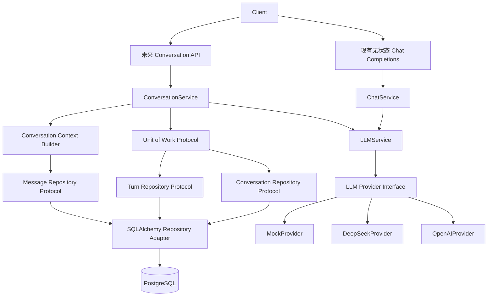

# Phase 8 — Conversation Domain / Chat Persistence Architecture Design

## 文档状态

- 类型：Architecture Design Only；
- 日期：2026-08-30；
- Phase 7：**Freeze Pending**；
- `v0.7.0`：**尚未创建**；
- Real LLM Integration：**Not Run**；
- Real LLM Cost：**0**；
- Phase 8 implementation：**不建议进入**。

本文只定义未来 Conversation Domain 与 Chat Persistence 的架构边界，不包含生产代码、
ORM Model、Alembic Migration、API、测试或运行配置实现。进入实现前，必须先解除 GitHub
Billing Lock，并取得 Default Offline CI 与 PostgreSQL Integration Workflow 的真实 Runner
通过证据，完成 Phase 7 正式 Freeze。

## 1. 目标与非目标

Phase 8 的目标是在现有无状态 Chat API 之上设计独立 Conversation Domain，使后续系统
能够可靠保存、查询和继续对话：

- 建立 Conversation、ConversationTurn 与 Message 的领域边界；
- 设计持久化 Schema 草案，但不创建 Migration；
- 定义 ORM 无关的 Repository Protocol 与 Unit of Work；
- 设计有状态对话 Application Service；
- 明确数据库事务与 LLM 网络调用边界；
- 保持现有无状态 Chat Completions 契约不变；
- 为未来 User、Agent、RAG、Home Assistant 等上层能力提供稳定基础。

本阶段不实现：

- Domain、ORM、Repository、Service 或 API；
- Alembic Migration；
- User、Auth、JWT 或权限系统；
- Redis、RAG、Agent、Tool Calling、MCP；
- 前端、WebSocket 或 Home Assistant；
- 真实 LLM 调用、密钥配置或费用测试。

## 2. 为什么先设计 Conversation Domain

Home Assistant、Agent 和 RAG 都需要稳定的对话上下文与持久化边界。Home Assistant 需要
明确一次指令属于哪个对话和 Turn；Agent 需要独立的执行状态，不能把中间过程混入普通
Message；RAG 需要知道检索结果服务于哪次 Turn，但检索数据并不等于聊天历史。

如果跳过 Conversation Domain 直接实现高级能力，容易造成 Provider Adapter 保存业务
状态、Chat Router 直接访问数据库、不同模块各自维护聊天历史，或把 Message 变成无约束的
JSON 容器。Conversation Domain 应先成为未来有状态 AI 能力共同依赖的稳定业务边界。

## 3. 总体架构



允许的依赖方向为：

```text
HTTP API
  -> Application Service
    -> Domain / Repository Protocol / LLMService
      -> Infrastructure Adapter
```

Domain 与 Application Service 不得依赖 FastAPI、SQLAlchemy、asyncpg、Redis 或具体
Provider。

## 4. 与现有阶段的关系

### Phase 3 Persistence Layer

未来只能通过新增 ORM Model、Alembic Migration 和 Repository Adapter 扩展，不得改变：

- AsyncSession 生命周期；
- Declarative Base 与 Metadata 语义；
- 现有 Alembic 历史；
- PostgreSQL readiness；
- 独立 Migration 启动链。

### Phase 5 Chat API

现有 `POST /api/v1/chat/completions` 必须继续保持无状态。它不得接受
`conversation_id`、保存 Message、加载数据库历史或改变 JSON/SSE 契约。有状态能力只能
通过新增 API 暴露。

### Phase 6 LLM Provider Layer

Conversation Application Service 只能调用 `LLMService`，不得调用具体 Provider、Registry、
Factory 或 Bootstrap。不得持久化供应商原始 JSON、HTTP Request/Response、Provider 原始
异常或 Authorization Header。

### Phase 7 Runtime

未来 Migration 继续由独立 Migration Container 执行，Backend 不自行迁移。Phase 8 不
改变 Compose 拓扑、`/ready`、默认 Mock Provider、默认离线测试或 Integration opt-in
策略。Phase 7 当前仍为 Freeze Pending。

## 5. Conversation Domain

### Conversation

Conversation 是 Aggregate Root，负责对话状态、Turn/Message 归属、归档写入限制、顺序和
并发边界。

建议属性：

| 属性 | 语义 |
|---|---|
| `id` | 不可预测 UUID |
| `title` | 可选显示标题，不参与身份识别 |
| `status` | `active` 或 `archived` |
| `created_at` | UTC 创建时间 |
| `updated_at` | UTC 更新时间 |
| `archived_at` | 可选归档时间 |

初期不设计硬删除。保留期限、合规擦除和恢复策略需要独立评审。

### ConversationTurn

ConversationTurn 表示一次模型生成操作，不替代 Message。它负责关联一条用户输入、零或
一条最终 Assistant Message、调用状态和安全 usage 摘要。

建议状态：`pending`、`completed`、`failed`、`cancelled`。

可以保存 request ID、独立 idempotency key、Provider 名称、模型名称、finish reason、
token usage 和安全错误码。不得保存 API Key、Provider 原始请求 ID、供应商错误正文、
HTTP/SDK 对象或流式 Chunk 序列。

### Message

Message 表示 Conversation 中已经接受的文本内容。初期只允许 `user` 和 `assistant`：

- 内容不得为空或全为空白；
- 必须关联 Conversation 和 Turn；
- Conversation 内 sequence 单调递增；
- 一个 Turn 必须有一个 user Message；
- 一个 Turn 最多有一个最终 assistant Message；
- 不保存未完成 Chunk，正文不得写入日志。

设计结论：Conversation、ConversationTurn 和 Message 都需要，但 ConversationTurn 只保存
最小的调用生命周期信息。

## 6. User 与 Auth

Phase 8 不建立 User 表，也不实现 Auth。初始部署只能视为单用户、本地可信环境或由外部
网关保护的内部系统。UUID 不是访问控制，`conversation_id` 不是身份凭据；不得宣称当前
设计支持安全的多用户隔离。

为未来兼容，当前不写死 User 外键，也不创建默认或匿名用户。未来认证阶段应通过新增
Migration 和所有权关系扩展，并让 Application Service 接收认证后的 Actor Context；届时
Repository 查询必须加入所有权范围。

## 7. 数据库 Schema 草案

本节只描述设计，不生成 ORM Model 或 Alembic Migration。

### `conversations`

| 字段 | 类型建议 | 约束 |
|---|---|---|
| `id` | UUID | Primary Key |
| `title` | VARCHAR(200) | Nullable |
| `status` | VARCHAR | `active/archived` Check |
| `next_sequence` | BIGINT | 正数，用于有序追加 |
| `created_at` | TIMESTAMPTZ | Not Null |
| `updated_at` | TIMESTAMPTZ | Not Null |
| `archived_at` | TIMESTAMPTZ | Nullable |

建议索引为 `status, updated_at` 和 `updated_at`。

### `conversation_turns`

| 字段 | 类型建议 | 约束 |
|---|---|---|
| `id` | UUID | Primary Key |
| `conversation_id` | UUID | Foreign Key |
| `sequence` | BIGINT | Conversation 内唯一 |
| `request_id` | VARCHAR | Nullable，仅用于关联 |
| `idempotency_key` | VARCHAR | Nullable，独立于 request ID |
| `status` | VARCHAR | 状态 Check |
| `provider_name` | VARCHAR | Nullable |
| `model_name` | VARCHAR | Nullable |
| `finish_reason` | VARCHAR | Nullable |
| `prompt_tokens` | INTEGER | Nullable、非负 |
| `completion_tokens` | INTEGER | Nullable、非负 |
| `total_tokens` | INTEGER | Nullable、非负 |
| `safe_error_code` | VARCHAR | Nullable |
| `created_at` | TIMESTAMPTZ | Not Null |
| `updated_at` | TIMESTAMPTZ | Not Null |
| `completed_at` | TIMESTAMPTZ | Nullable |

建议约束：`conversation_id, sequence` 唯一；`conversation_id, idempotency_key` 唯一；
request ID 不得被解释为幂等键。

### `messages`

| 字段 | 类型建议 | 约束 |
|---|---|---|
| `id` | UUID | Primary Key |
| `conversation_id` | UUID | Foreign Key |
| `turn_id` | UUID | Foreign Key |
| `role` | VARCHAR | `user/assistant` Check |
| `content` | TEXT | 非空白 |
| `sequence` | BIGINT | Conversation 内唯一 |
| `created_at` | TIMESTAMPTZ | Not Null |

建议约束：`conversation_id, sequence` 唯一，`turn_id, role` 唯一，并为
`conversation_id, sequence` 建立索引。所有对象命名必须沿用 Phase 3 Naming Convention。

不加入通用 metadata JSON、Provider options、原始 usage、Chunk、Embedding、Tool Call 或
User 外键。

## 8. Repository Protocol 与 Unit of Work

Repository Protocol 应位于 Application/Domain 边界，而不是 SQLAlchemy 基础设施目录：

- Conversation Repository：新增、按 ID 获取、分页、保存状态、提供并发保护；
- Turn Repository：创建、查询、按幂等键查询、更新状态和安全摘要；
- Message Repository：有序追加、分页读取、为 Context Builder 读取有界历史；
- Unit of Work：暴露 Protocol，明确 commit/rollback，隐藏 AsyncSession 与 SQLAlchemy。

现有 `BaseRepository` 只能作为实现工具，不能成为 Application Service 直接依赖的业务
契约。Repository 不得向 Application Service 返回 ORM 对象。

## 9. Application Service

建议分成三个职责：

- ConversationCommandService：创建和归档 Conversation，校验写入状态；
- ConversationQueryService：获取和分页查询 Conversation/Message，不调用 LLM；
- ConversationChatService：创建 Turn/User Message、构建上下文、调用 LLMService、保存
  最终 Assistant Message 并更新 Turn。

Context Builder 只读取已完成 Message，输出冻结的 `LLMRequest`，保持 Provider 无关，并
应用明确的消息数量或上下文预算。不得默认读取无限历史，也不执行 RAG、总结或 Embedding。

## 10. API 边界

现有无状态端点保持不变。未来可以独立设计以下 API：

| Endpoint | 职责 |
|---|---|
| `POST /api/v1/conversations` | 创建 Conversation |
| `GET /api/v1/conversations` | 游标分页查询 |
| `GET /api/v1/conversations/{id}` | 获取 Conversation |
| `GET /api/v1/conversations/{id}/messages` | 分页读取消息 |
| `POST /api/v1/conversations/{id}/turns` | 提交用户消息并生成回复 |
| `POST /api/v1/conversations/{id}/archive` | 归档 |

上述路径只是未来 API Boundary 草案，本阶段不创建 Endpoint。初始实现建议只支持非流式
持久化 Turn；持久化 SSE 应独立设计，不得修改或直接扩充 Phase 5 SSE DTO。

## 11. LLM 调用、事务与错误边界

严禁在数据库事务内等待 LLM 网络调用。推荐流程：

1. 短事务中锁定或校验 Conversation；
2. 创建 pending Turn 并追加 User Message；
3. Commit；
4. 在事务外构造上下文并调用 `LLMService`；
5. 成功后在新事务中原子追加 Assistant Message、usage，并完成 Turn；
6. 失败或取消时以独立短事务更新 Turn 状态。

崩溃可能留下 pending Turn，但不得自动重新调用 LLM，避免重复内容和费用。恢复策略必须
显式设计。

建议领域错误包括 ConversationNotFound、ConversationArchived、ConversationConflict、
TurnNotFound、TurnAlreadyCompleted、IdempotencyConflict 和 ConversationPersistenceError。
HTTP 边界应使用安全错误码，不得暴露 SQLAlchemy/asyncpg 异常、SQL、数据库连接信息、
Provider 异常、Prompt 或完整 Response。

## 12. 测试策略

### Default Offline Tests

- Domain invariant tests；
- Fake Repository/UoW 下的 Application Service tests；
- Mock LLMService；
- API Schema 与 Dependency Override；
- Error Mapping、架构扫描和现有无状态 Chat API 回归；
- 零 PostgreSQL、零 API Key、零外部网络。

### Repository Tests

通过显式 `--run-integration` 使用隔离 PostgreSQL 17，验证 CRUD、顺序、分页、约束、并发、
幂等、commit/rollback 和事务隔离。

### Application Service Tests

验证 User Message/Turn 原子创建、LLM 调用位于事务外、成功响应保存、失败/取消状态、
CancelledError 传播、没有具体 Provider 依赖，以及不存在自动 LLM retry。

### API Contract Tests

验证新 API 与无状态 API 分离、Conversation ID 不进入 `/chat/completions`、分页和错误契约、
不暴露 ORM/LLM DTO，以及 Router 不直接依赖 Repository。

### Migration Tests

仅在后续实现阶段实际创建 Migration 后，验证从 Phase 7 基线升级、空数据库升级、既有
数据保持、命名规范及 `alembic upgrade head`。不得使用 `create_all()`。

## 13. Phase 8 Step Plan

| Step | 目标 | 输出 | 验收标准 |
|---|---|---|---|
| Step 1 | Domain Model Design | Conversation、Turn、Message 领域草案和状态规则 | 纯设计，无 ORM/FastAPI 实现 |
| Step 2 | Persistence Schema Design | ORM Model 草案与 Alembic Migration 设计草案 | 不生成实际 Migration；实现阶段再创建迁移 |
| Step 3 | Repository Protocol Design | Protocol 与 Unit of Work 设计 | Application 不依赖 SQLAlchemy |
| Step 4 | Application Service Design | Command、Query、ConversationChat Service 设计 | 事务不跨越 LLM 调用 |
| Step 5 | API Boundary Design | Conversation HTTP Schema/Route 草案 | 现有 Chat API 零变更，不新增 Endpoint |
| Step 6 | Testing Strategy | Domain、Service、API、Repository、Architecture 测试计划 | 默认离线，PostgreSQL 显式 opt-in |
| Step 7 | Documentation and Release Gate Update | 架构文档与 Freeze 检查计划 | 文档和证据状态一致 |

Step Plan 是后续设计/实施顺序，不代表任何 Step 已实现。实际 ORM 和 Migration 只能在
Entry Criteria 满足并获得实施授权后创建。

## 14. Implementation Entry Criteria

进入 Phase 8 implementation 前必须满足：

1. Phase 8 架构设计正式确认；
2. GitHub Billing Lock 已解除；
3. Default Offline CI 在真实 GitHub Runner 通过；
4. PostgreSQL Integration Workflow 在真实 Runner 通过；
5. Manual LLM Workflow 的审批与 fail-closed 路径得到验证；
6. Real LLM 可以继续为 Not Run，除非另有明确授权、密钥和成本确认；
7. Phase 7 完成正式 Freeze；
8. `v0.7.0` 只能在 Phase 7 全部硬门禁通过后创建；
9. 工作树 clean，当前 Alembic head 和 PostgreSQL 17 基线已确认；
10. 单用户可信部署和无 Auth 风险已被明确接受。

## 15. Phase 8 Freeze Criteria

- Conversation、Turn、Message 领域规则稳定；
- 实现阶段创建的 Alembic Migration 在 PostgreSQL 17 通过；
- Repository Protocol 与 SQLAlchemy Adapter 解耦；
- Application Service 不依赖 FastAPI、SQLAlchemy 或具体 Provider；
- 数据库事务不跨越 LLM 调用；
- 新 Conversation API 契约稳定，Phase 5 无状态 API 无回归；
- 默认 pytest 零数据库、零密钥、零公网并通过；
- PostgreSQL Integration 通过；
- 不存在自动 LLM retry、fallback 或 routing；
- 不保存 Chunk、供应商异常或原始载荷；
- `/health`、`/ready`、`/version` 语义不变；
- Phase 3–7 边界扫描、文档和 Release Gate 一致；
- Phase 7 已正式 Freeze。

## 16. 禁止事项

Phase 8 不得：

- 修改 `/api/v1/chat/completions` 或给它加入 `conversation_id`；
- 让 Chat Router 直接访问 Repository；
- 让 Conversation Service 调用具体 Provider；
- 让 Provider、LLMService 或 Persistence 反向依赖 Conversation；
- 在 LLM 调用期间持有数据库事务；
- 使用 `create_all()` 或修改历史 Migration；
- 保存 Chunk、API Key、Authorization Header、供应商错误体或原始载荷；
- 使用通用 JSON metadata 逃生口；
- 实现 User/Auth/JWT、Redis、RAG、Embedding、Agent、Tool Calling、MCP、Home Assistant、
  WebSocket 或前端；
- 自动 retry、fallback、降级或 Provider routing；
- 运行真实 LLM 或配置真实 OpenAI/DeepSeek Key；
- 修改 Phase 7 状态、创建 `v0.7.0` 或进入 Phase 8 implementation。

## 17. 结论

Conversation Domain 是下一层合理架构，它能在不破坏无状态 Chat API 和 LLM Provider
边界的前提下，为未来有状态聊天及更高层能力提供稳定基础。

当前**不建议进入 Phase 8 implementation**。必须先解除 GitHub Billing Lock，取得
Default Offline CI 与 PostgreSQL Integration Workflow 的真实 Runner 通过证据，并完成
Phase 7 正式 Freeze。Real LLM 继续保持 `Not Run`，Cost 为 `0`；本设计不会改变 Phase 7
`Freeze Pending` 状态。
